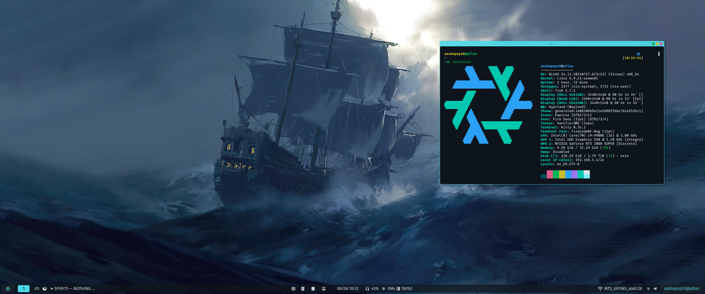
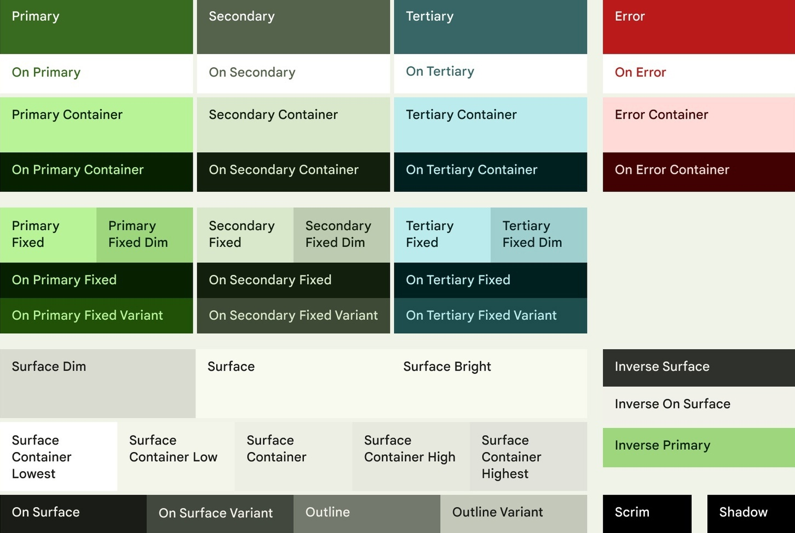

<h1 align="center">Deep dive into declarative configuration</h1>



## Installation

```bash
# Working with Live CD
nix-shell -p curl git
curl https://github.com/sashapop10/nixos/hosts/<hostname>/disko.nix
# Edit disko.nix (replace device with name from lsblk result)
sudo nix --experimental-features "nix-command flakes" run github:nix-community/disko -- --mode disko ./disko.nix
git clone https://github.com/sashapop10/nixos /mnt/flake
mkdir /mnt/flake/generated nixos-generate-config --dir /mnt/flake/generated
mv -f /mnt/flake/generated/hardware-configuration.nix /mnt/flake/core/hosts/<hostname>
sudo nixos-install --flake /mnt/flake#<username>@<hostname>
reboot
```

# Update

```bash
nix-channel --update
nix flake update
sudo nixos-rebuild --upgrade switch --flake .#<username>@<hostname>
```

## Rebuild

```bash
git add . # Important if new files were created
sudo nixos-rebuild switch --flake .#<username>@<hostname> # If Hosts updated
home-manager switch --flake .#<username>@<hostname> # If ONLY Home updated
```

## Structure

- `.vscode`: Makes vscode more performant in this directory.
- `flake.nix`: Entrypoint for hosts and home configurations.
- `shell.nix`: Exposes a dev shell for bootstrapping.
- `home`: Home-manager configuration
- `core`: NixOS Configurations
  - `users`: Users configuration
  - `hosts`: Hardware specific configurations
    - `atlas`: Desktop PC - 32GB RAM, i9-9900k, RTX 2080S & UHD630 | Hyprland
    - `hermes`: Laptop - 16GB RAM, i7-1165G7, Iris XE | Hyprland
      global: Configurations that are globally applied to all my machines.
      optional: Opt-in configurations my machines can use.
- `library`:
  - `vars`: Global variables, accessible through { vars, ... }:
  - `overlays`: Patches and custom overrides for some packages.
  - `modules`: Modules for more accurate customization.
  - `pkgs`: Self hosted packages.

## About colors

System _color_ schema will be generated based on all stored wallpapers;
Each time wallpaper changes color - schema changes too.
This behavior works thanks to [Mutagen](https://github.com/InioX/matugen).

<div align="center">



### Keywords to operate with

| keyword                  | keyword                  | keyword                    |
| ------------------------ | ------------------------ | -------------------------- |
| primary                  | error                    | secondary                  |
| on_primary               | on_error                 | on_secondary               |
| primary_container        | error_container          | secondary_container        |
| on_primary_container     | on_error_container       | on_secondary_container     |
| inverse_primary          | surface_dim              | secondary_fixed            |
| primary_fixed            | surface                  | secondary_fixed_dim        |
| primary_fixed_dim        | surface_bright           | on_secondary_fixed         |
| on_primary_fixed         | surface_container_lowest | on_secondary_fixed_variant |
| on_primary_fixed_variant | surface_container_low    | tertiary                   |
| surface_container        | surface_container_high   | surface_container_highest  |
| on_surface               | on_surface_variant       | outline                    |
| outline_variant          | inverse_surface          | inverse_on_surface         |
| on_tertiary              | surface_variant          | tertiary_container         |
| background               | on_tertiary_container    | on_background              |
| tertiary_fixed           | shadow                   | tertiary_fixed_dim         |
| scrim                    | on_tertiary_fixed        | on_tertiary_fixed_variant  |
|                          | source_color             |                            |

</div>

### Tuning example

```nix
let
inherit (config.colorscheme) colors harmonized;
in {
  programs.program = {
    enable = true;# Base 16
    colorscheme = {# All colors in #HEX format
      base00 = "${colors.surface}"; # bg
      base01 = "${colors.surface_variant}"; # bg alt 1
      base02 = "${colors.tertiary_container}"; # bg alt 2
      base03 = "${colors.primary_container}"; # bright bg
      base04 = "${colors.on_surface_variant}"; # fg alt 1
      base05 = "${colors.on_surface}"; # fg
      base06 = "${colors.on_tertiary_container}"; # fg alt 2
      base07 = "${colors.on_primary_container}"; # bright fg
      base08 = "${harmonized.red}"; # ! red
      base09 = "${colors.primary}"; # accent 1
      base0A = "${harmonized.yellow}"; # yellow
      base0B = "${harmonized.green}"; # * green
      base0C = "${harmonized.cyan}"; # ? cyan
      base0D = "${harmonized.blue}"; # ? blue
      base0E = "${harmonized.magenta}"; # magenta
      base0F = "${colors.error}"; # accent 2
    };
  };
}
```

<p align="center">
Copyright © 2023 <a href="https://github.com/sashapop10">sashapop10</a>.<br/>
This package is <a href="./LICENSE">MIT licensed</a>.<br/>
</p>
